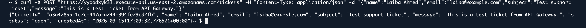
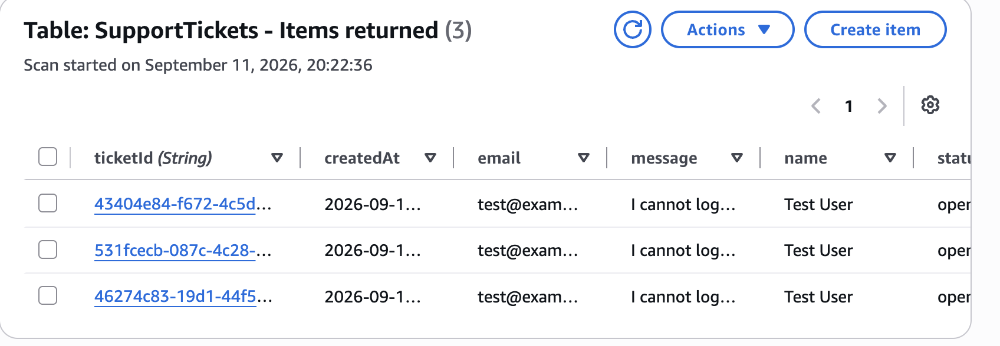
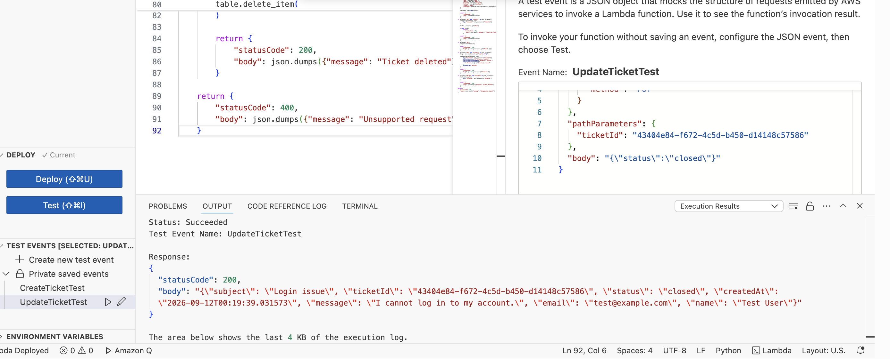
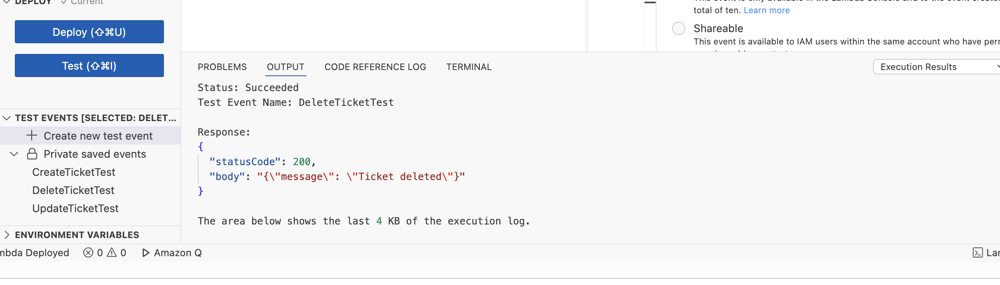

# AWS Serverless Support Ticket API

A serverless backend for creating and retrieving support tickets using AWS Lambda, API Gateway, and DynamoDB.

I built this project to work through the backend flow of an API from request to storage: API Gateway receives the request, Lambda handles the application logic, and DynamoDB stores the ticket data.

## Project Snapshot

**AWS services used**

- AWS Lambda
- Amazon API Gateway
- Amazon DynamoDB
- AWS CloudShell

**DynamoDB table**

`SupportTickets`

**HTTP API routes**

| Method | Route | Purpose |
| --- | --- | --- |
| POST | `/tickets` | Create a new support ticket |
| GET | `/tickets/{ticketId}` | Retrieve a ticket by ID |

## Request Flow

```text
Client
  |
  v
API Gateway
  |
  v
AWS Lambda
  |
  v
Amazon DynamoDB
```
API Gateway provides the public HTTP endpoint and sends requests to the Lambda function. Lambda processes the request and reads from or writes to the `SupportTickets` DynamoDB table.

## Ticket Data

Each support ticket includes:

- Ticket ID
- Name
- Email
- Subject
- Message
- Status
- Creation timestamp

New tickets are stored with an `open` status and a generated ticket ID.

## API Testing

I tested the deployed API from AWS CloudShell to confirm the full request path was working.

### Creating a Ticket

The `POST /tickets` route creates a new support ticket through API Gateway.



The request returned the newly created ticket information, including its generated ticket ID.

### Retrieving a Ticket

I used that ticket ID to test the `GET /tickets/{ticketId}` route.


The API returned the stored ticket successfully, confirming the request could travel through API Gateway and Lambda and retrieve the correct data.

## DynamoDB Storage

The ticket records are stored in the `SupportTickets` DynamoDB table.



Checking the table directly also gave me a way to verify that the data created by the backend was being persisted correctly.

## Lambda Testing

I also tested additional ticket operations directly from the Lambda console.

### Update Ticket

The update test changed an existing ticket and returned a successful Lambda response.



### Delete Ticket

The delete test confirmed that the backend could remove a ticket successfully.



## What I Worked Through

This project gave me more experience connecting multiple AWS services into one working backend instead of working with each service separately.

I worked through:

- Lambda request handling
- DynamoDB reads and writes
- API Gateway and Lambda integration
- HTTP routes and path parameters
- Testing deployed endpoints with CloudShell
- Troubleshooting endpoint and request-formatting issues
- Verifying data directly in DynamoDB

## Current State

The deployed HTTP API currently supports:

- `POST /tickets`
- `GET /tickets/{ticketId}`

Update and delete logic were also tested directly through Lambda.

If I continued building this project, I would expose those operations through API Gateway and add authentication, stronger request validation, logging, and a simple frontend for submitting support tickets.
